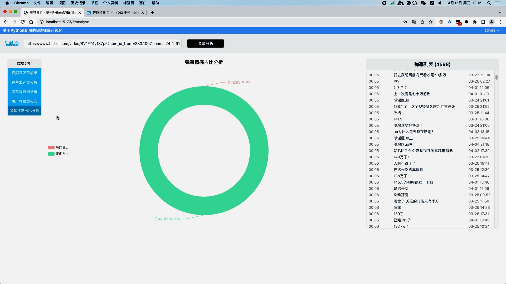
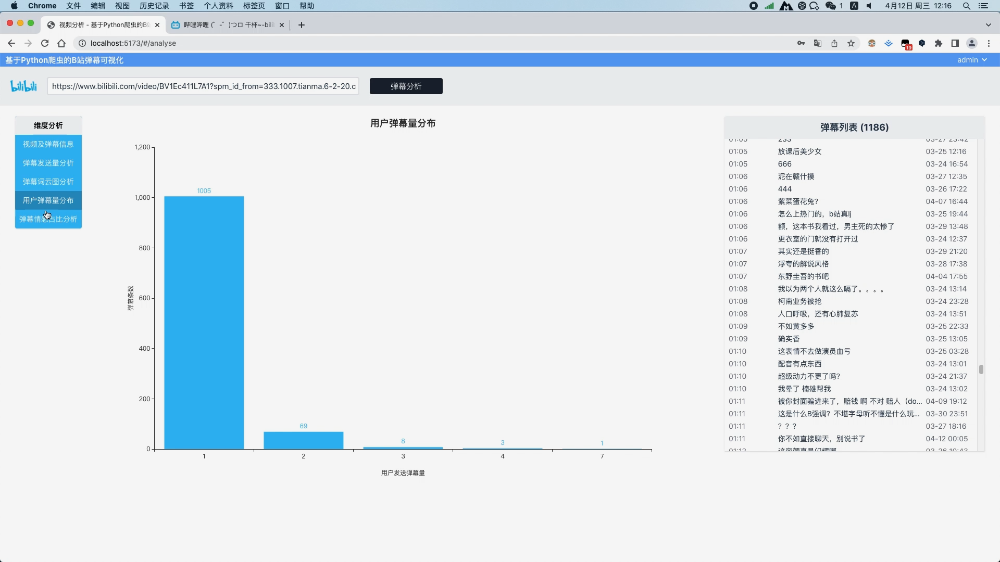

## 计算机毕业设计Django+Vue.js弹幕可视化 B站弹幕可视化 弹幕情感分析 Python视频数据分析 视频可视化 机器学习 深度学习 Python爬虫 知识图谱 Hadoop Spark

## 要求
### 源码有偿！一套(论文 PPT 源码+sql脚本+教程)

### 
### 加好友前帮忙start一下，并备注github有偿纯python汽车分析
### 我的QQ号是2827724252或者798059319或者 1679232425或者微信:bysj2023nb 或bysj1688

# 

### 加qq好友说明（被部分 网友整得心力交瘁）：
    1.加好友务必按照格式备注
    2.避免浪费各自的时间！
    3.当“客服”不容易，repo 主是体面人，不爆粗，性格好，文明人。

### 技术
python django requests jieba echarts vue element-plus axios vue-router 朴素贝叶斯算法分析情感分类 爬虫抓取Bilibili视频弹幕 

### 装逼显摆点
  弹幕文本清洗 弹幕文本分词 去除弹幕文本停用词 弹幕发送量分析并以折线图展示视频过程中每一秒的弹幕量 弹幕文本分词分析并以词云图展示关键词 
  使用朴素贝叶斯算法分析弹幕情感并以饼图进行可视化 通过爬虫可以得到视频的标题、视频总时长、封面图，视频地址以及所有弹幕数据等

演示视频
https://www.bilibili.com/video/BV1Ez421q7tU/?spm_id_from=333.999.0.0

